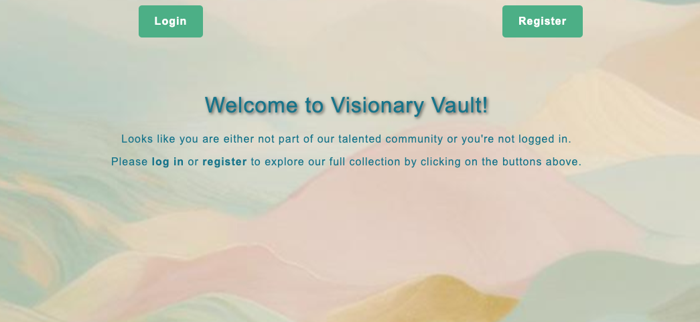
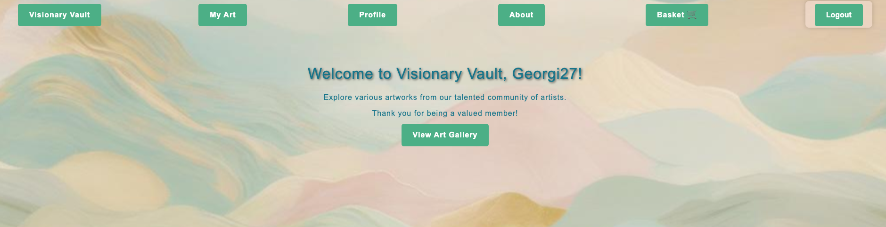
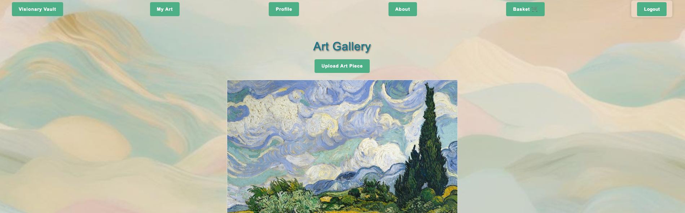
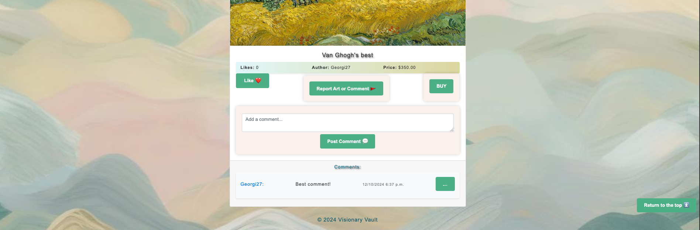
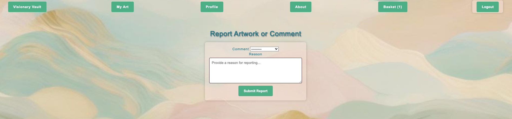
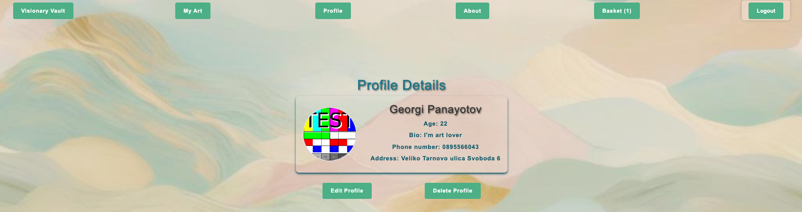
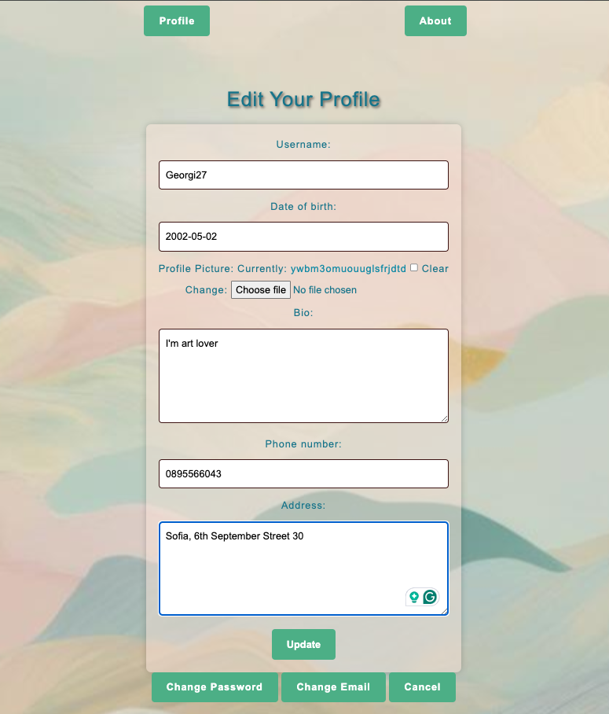
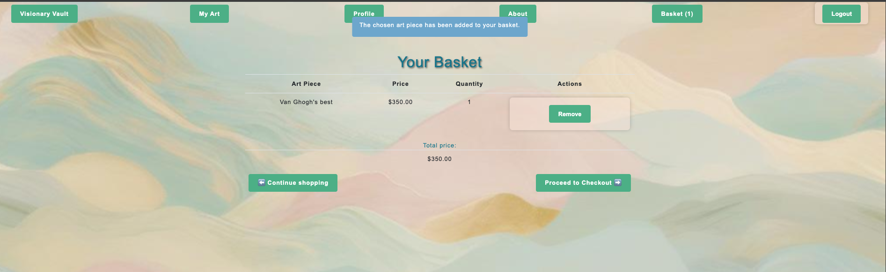
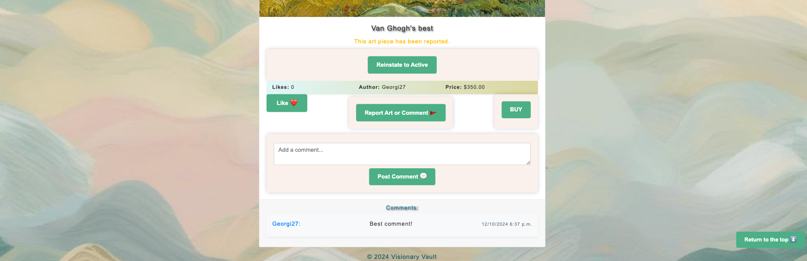
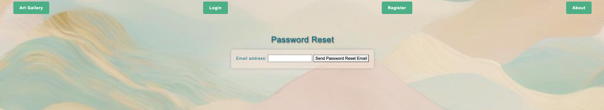

# VisionaryVault

# 1. Visionary Vault App

This is a platform for art lovers to upload, explore, and engage through art. 
* Link to the deployed project: 

      https://visionaryvault-dmh7cpcuakfee0es.italynorth-01.azurewebsites.net/

# 2. Description
* VisionaryVault is a web application connecting art enthusiasts with stunning pieces. Users can create profiles to track interactions, browse collections, engage through comments and likes, and securely purchase art. The platform allows easy profile management, enabling users to edit or delete their profiles and artworks as needed.

# 3. Technologies Used

* **Django** – Web framework used to build the application.
* **Python** – Programming language for the backend.
* **Django REST Framework** – For building the API for interactions like comments, likes, and reporting, etc.
* **JavaScript** – For client-side interactions.
* **PostgreSQL** – Database used to store user data and art pieces.
* **HTML/CSS** – For frontend design and layout.
* **Cloudinary** - For better handling of media files
* **Azure** - Platform used for the deploying of the project

# 4. Installation
   **Step-by-step guide to setting up the project locally:** 

* **Clone the repository**

       git clone https://github.com/GeorgiPanayotov/VisionaryVault

* **Navigate into the project folder**

       cd your-project

* **Create and activate a virtual environment**

*      python -m venv venv
*      source venv/bin/activate  # On Windows: venv\Scripts\activate

* **Configure Environment Variables**

* Edit the.env file and fill in the required values, such as:

**SECRET_KEY:** A secret key for Django.

**Database connection settings:** (DB_NAME, DB_USER, DB_PASSWORD, etc.).

**DEBUG:** Set to True for development, False for production.

**ALLOWED_HOSTS:** Add your allowed hosts, separated by commas.

### - **Setup the Database:** 

**Install dependencies**

*     pip install -r requirements.txt

**Create migrations and then run them**

*     python manage.py makemigrations 
*     python manage.py migrate

**Run the development server**
*     python manage.py runserver

**Create a Superuser**
*     python manage.py createsuperuser

* _By default, the server runs on_

*     http://127.0.0.1:8000/.

**Running Tests**

* _Tests are located in the tests package directories in Art & Accounts applications._

* _To run the tests:_

*     python manage.py test

# 5. User experience

#### **After user either Register or Log-in:**

#### **Navigation bar appears on top:** 

#### **Upload art: Share art pieces in various categories.**

#### **Interact with the art: Like, comment, report and buy functionalities are available:**

#### **Report content: Report inappropriate art or users:**

#### **Manage profile: Edit username, email, and password:**

#### **Basket for better managing of user's purchases**

#### **View and follow reported content: Moderators and shift managers can manage content reports and user bans.**

#### **Password reset: Customers can reset their password via email.**

# 6. Architecture
_The VisionaryVault application follows a modular and scalable architecture, ensuring that core functionalities are decoupled and easily maintainable. Below is an overview of its architecture:_

### 1. Multi-App Structure
The project is divided into separate Django apps, each responsible for specific functionalities:
* **VisionaryVaultApp:** The main Django project folder, containing configuration files and core settings.
### Apps: 
* **Accounts App:**

   _Responsible for **user-related features.** Handles user authentication, registration, profile management,password resets, etc._

* **Art App:**

  _Responsible for **art-related features.** Manages CRUD operations for art pieces, user interactions (likes, comments), and category management._

* **Reporting App:** 

  _Responsible for **Reporting and moderation functionalities**. Provides tools for moderators and shift managers to handle reports of inappropriate content and user bans._

* **Common App:** 

  _Responsible for **shared utilities.** Handles basket functionalities such as add and remove item.It also contains shared functionality, such as context processors, or reusable views._

* **Templates:** 

  _Organized directories, for HTML templates (one for each app **accounts, art, common & reporting**)._

* **Docs:** 

  _Contains images only used in the README._

* **.env.template**

  _Help in understanding and configuring the environment variables required for the application to run correctly_

* **requirements.txt**

  _Lists all the Python libraries that the project depends on, including their specific versions._

_This modular approach allows for independent development and testing of each app._

### 2. User roles
_The platform incorporates multiple user roles to enhance user experience and maintain content quality:_

* **Regular Users:** Can upload, like, comment, report content, and manage their profiles.
* **Moderators:** Review reported content and take action on inappropriate submissions.
* **Shift Managers:** Handle user bans in addition to moderator responsibilities.
* **Banned Users:** Restricted from interacting with the platform until unbanned.

### 3. Backend
* **Django Framework:** The project is built using Django, leveraging its MTV (Model-Template-View) design pattern for rapid and scalable development.
* **Django REST Framework:** Provides a powerful API layer to handle interactions like likes, comments, reporting, and basket management.

_Key backend components:_

* **Models:** Define the database schema for user profiles, art pieces, reports, and other interaction.
* **Views:** Implement application logic for serving web pages and APIs.
* **Templates:** Provide the HTML structure for rendering dynamic content.

### 4. Frontend
* **HTML/CSS/JavaScript:** Used for creating a user-friendly interface.
* **Dynamic Interactions:** JavaScript adds responsiveness and functionality to features like liking, commenting, and report forms.

### 5. Database
* **PostgreSQL:** The database system used for storing user data, art pieces, comments, categories, etc. It is chosen for its reliability and scalability for production environments.

### 6. Media and Static File Management
* **Static Files:**

    _Stored in the static directory for development._

    _Collected into the **staticfiles directory** during deployment using **collectstatic.**_

    _Served using **WhiteNoise** in production._

* **Media Files:**

   _Handled by **Cloudinary**, allowing efficient storage and retrieval of user-uploaded images._

# 7. Deployment
* **Azure App Service:** 

   _The project is deployed to Azure, utilizing the scalability and reliability of the platform._

* **GitHub Actions Workflow:** 

  _Automates the build and deployment process. Changes pushed to the repository trigger a pipeline that deploys the latest version to Azure._

# 8. Contributing

_Contributions to improve VisionaryVault are very welcome!  To contribute:_

* Fork the repository.
* Create a new branch for your feature or bug fix.
* Make your changes and commit them.
* Push to your forked repository.
* Open a pull request to the main branch of the original repository.

# 9. License
 _This project is licensed under the MIT License. See the LICENSE file for more details._

# 10. Contact

_For any questions or feedback, feel free to contact:_
* **Email:** georgipanayotov1995@gmail.com
* **GitHub:** https://github.com/GeorgiPanayotov/VisionaryVault